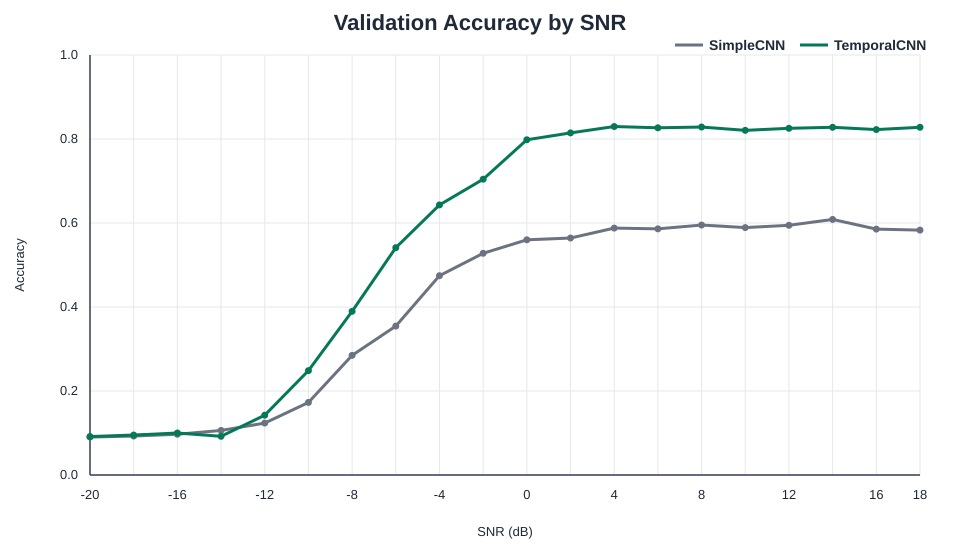
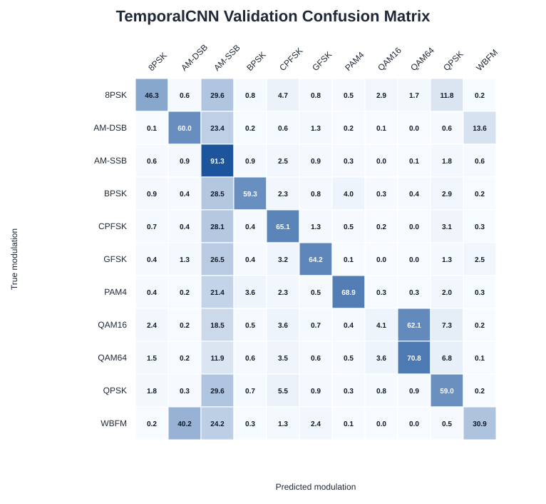
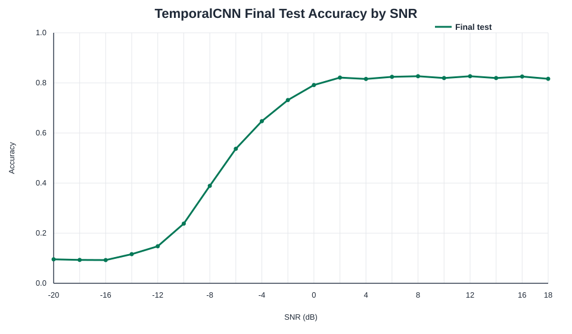

# Wireless Signal Modulation Classification

基于 PyTorch 的无线信号自动调制识别与 SNR 鲁棒性评估。

## 当前阶段

项目处于 Phase 15：封存测试集最终验收。第一版SimpleCNN在33,000条验证集上取得40.89% Accuracy和38.20% Macro F1；只改变模型结构后，TemporalCNN验证集达到56.35% Accuracy和56.23% Macro F1，分别提高15.46和18.03个百分点。两次实验使用相同的154,000条训练集、数据划分、随机种子和训练配置。

模型与评估协议冻结后，首次在33,000条封存测试样本上进行最终验收，取得56.38% Accuracy和56.26% Macro F1。测试成绩没有用于继续调参。公开仓库保存了冻结协议、模型与结果哈希、指标摘要、混淆矩阵和按SNR图表；受数据许可与文件大小限制，原始数据、模型检查点和生成的运行时产物不随仓库分发。








已验证环境：Python 3.12.10、PyTorch 2.12.1+cu130、NumPy 2.5.2、RTX 4060 Laptop GPU。

## 项目亮点

- 对旧Pickle数据采用受限加载、归档审计、SHA-256和结构校验，降低不可信反序列化风险；
- 按“调制方式 + SNR”分层执行70%/15%/15%划分，固定随机种子并检查集合互斥；
- 用PyTorch实现完整训练循环、最佳检查点、早停、Accuracy、Macro F1、混淆矩阵和按SNR评估；
- 在其余实验条件不变时，将全局平均基线替换为保留8段时序特征的TemporalCNN；
- 在读取测试指标前冻结模型哈希和评估协议，避免测试集参与模型选择；
- 84项自动化测试覆盖数据、模型、训练、指标、结果图表和最终评估保护。

## 快速开始

项目使用Python 3.12。CPU环境可以创建独立虚拟环境后安装项目：

```powershell
python -m venv .venv
.\.venv\Scripts\python.exe -m pip install --upgrade pip
.\.venv\Scripts\python.exe -m pip install -e .
```

Windows + NVIDIA GPU环境可以根据已验证配置安装PyTorch CUDA wheel：

```powershell
python -m venv .venv
.\.venv\Scripts\python.exe -m pip install --upgrade pip
.\.venv\Scripts\python.exe -m pip install -r requirements-gpu.txt
.\.venv\Scripts\python.exe -m pip install -e . --no-deps
```

运行全部离线测试不需要RadioML数据集、GPU或API密钥：

```powershell
.\.venv\Scripts\python.exe -m unittest discover -s tests -v
```

## 数据准备

RadioML 2016.10A来自[DeepSig官方数据页面](https://www.deepsig.ai/datasets/)，数据许可为CC BY-NC-SA 4.0。仓库采用MIT许可证只覆盖本项目代码，不改变数据集许可证。

仓库不重新分发数据。完成官方登记和下载后，先保留原始压缩包并执行只读审计，再将官方Pickle放在Git忽略的目录：

```text
data/raw/RML2016.10a/RML2016.10a_dict.pkl
```

数据集安全检查、已验证SHA-256和已知限制见[`docs/DATASET_AUDIT.md`](docs/DATASET_AUDIT.md)。不要对来源不明的Pickle文件直接调用普通`pickle.load`。

## 公开证据范围

仓库可直接审查训练与评估代码、自动化测试、最终启封协议、检查点和结果哈希、指标摘要及SVG图表。`data/raw/`、PyTorch检查点和`artifacts/`生成目录由Git忽略，不属于公开交付物。复现实验需要使用者从DeepSig官方渠道取得数据并重新训练；README中的结果是本项目已完成实验的记录，不代表克隆仓库后已经包含训练好的模型。

## 复现实验

以下命令中的输出目录必须为空，脚本会拒绝覆盖已有实验：

```powershell
# 原始SimpleCNN基线
.\.venv\Scripts\python.exe scripts\train_radioml_baseline.py `
  data\raw\RML2016.10a\RML2016.10a_dict.pkl `
  artifacts\simple_cnn_baseline `
  --model-variant simple

# 受控TemporalCNN候选实验
.\.venv\Scripts\python.exe scripts\train_radioml_baseline.py `
  data\raw\RML2016.10a\RML2016.10a_dict.pkl `
  artifacts\temporal_cnn_candidate `
  --model-variant temporal
```

生成验证集图表：

```powershell
.\.venv\Scripts\python.exe scripts\generate_validation_figures.py `
  artifacts\simple_cnn_baseline\validation_result.json `
  artifacts\temporal_cnn_candidate\validation_result.json `
  artifacts\validation_figures
```

`evaluate_frozen_test_set.py`绑定本项目最终候选检查点、数据集哈希和第13轮选择结果，只用于审计记录中的一次最终验收。开发新模型时不能重复使用当前测试成绩调参；应重新建立新的未见测试集。

## 最终结果与边界

| 模型/数据范围 | Accuracy | Macro F1 |
| --- | ---: | ---: |
| SimpleCNN验证集 | 40.89% | 38.20% |
| TemporalCNN验证集 | 56.35% | 56.23% |
| TemporalCNN封存测试集 | **56.38%** | **56.26%** |

最终总体指标包含11种调制方式和-20 dB至18 dB全部SNR条件。0 dB以上测试准确率约79%–83%，但极低SNR接近随机水平，QAM16 Recall只有4.07%。项目结果只能说明该方法在RadioML 2016.10A同分布数据上的表现，不能直接外推至真实空口环境。

## V1 目标

- 读取并检查带有调制类别和 SNR 标签的 I/Q 信号数据。
- 建立可复现的训练集、验证集和测试集划分。
- 先实现简单基线，再实现小型 1D CNN。
- 使用 Accuracy、Precision、Recall、F1、混淆矩阵和按 SNR 分组的准确率评估模型。
- 进行一次范围受控的改进实验，并如实记录有效和无效结果。
- 提供可复现的配置、测试、文档和运行说明。

## 暂不包含

- Transformer、GAN、强化学习或大型模型。
- 前端、在线服务和复杂部署。
- 真实空口生产数据采集。
- 未经验证的性能结论。

## 目录

```text
src/signal_modulation/   核心 Python 包
tests/                   自动化测试
data/                    数据说明；原始数据不提交 Git
artifacts/               模型、图表和实验输出；大文件不提交 Git
docs/                    范围、设计和学习记录
scripts/                 环境、数据和训练演示脚本
.github/workflows/       无真实数据依赖的持续集成
```

学习顺序：

1. `docs/LEARNING_01_IQ_SNR.md`
2. `docs/LEARNING_02_DATA_SPLIT.md`
3. `docs/LEARNING_03_DATASET_DATALOADER.md`
4. `docs/LEARNING_04_CNN_FORWARD.md`
5. `docs/LEARNING_05_TRAINING_LOOP.md`
6. `docs/LEARNING_06_BEST_MODEL_EARLY_STOPPING.md`
7. `docs/LEARNING_07_RADIOML_DATASET.md`
8. `docs/LEARNING_08_RADIOML_DATALOADER.md`
9. `docs/LEARNING_09_SMOKE_TRAINING.md`
10. `docs/LEARNING_10_EVALUATION_METRICS.md`
11. `docs/LEARNING_11_FULL_BASELINE_PLAN.md`
12. `docs/LEARNING_12_BASELINE_RESULT.md`
13. `docs/LEARNING_13_TEMPORAL_CNN_COMPARISON.md`
14. `docs/FINAL_EVALUATION_PROTOCOL.md`
15. `docs/LEARNING_14_FINAL_TEST_RESULT.md`

模型开发、最终测试和本地工程交付闭环已经完成。项目使用独立Git仓库和无真实数据依赖的CI配置；发布到GitHub后可直接运行离线测试。当前模型不再根据已启封测试集调整。
